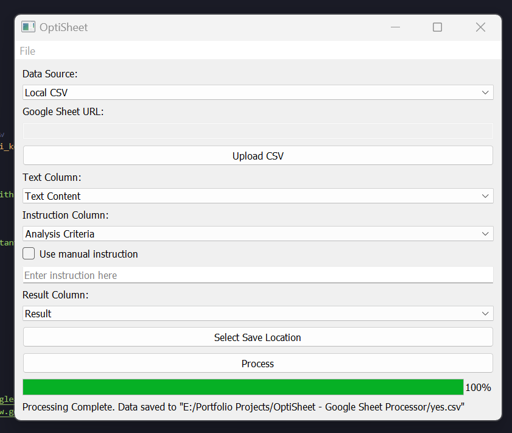

# OptiSheet: AI-Based Data Processing Tool

## Introduction
OptiSheet is an AI-powered, easy-to-use tool designed for efficient data analysis and manipulation. It's tailored to work with multiple Google Sheets of the same structure and supports CSV file processing. This desktop application is ready to use on your local computer with no specific technical requirements, streamlining data handling tasks with the power of AI.

## Core Features
- **Google Sheet Integration**: Load data directly using Google Sheet URLs (authentication required).
- **CSV File Support**: Handles CSV files from both local disks and Google Sheet CSV URLs.
- **Data Processing with AI**: Leverages the GPT-4 model for advanced data analysis and updates.
- **Result Exporting**: Option to save processed results locally or directly in Google Sheets.
- **User-Friendly Interface**: Easy-to-use graphical interface for all operations.

## How it Works
- The tool allows manual input of Google Sheet links and CSV file selection.
- Users can set analysis criteria, select specific columns for analysis, and designate a column for results.
- Securely enter your GPT API key for integrating the GPT-4 model in data processing.
- It includes a status indicator and comprehensive error handling features.
- The application is designed to be compatible with multiple Google Sheets of the same structure, enhancing its versatility.

## Setup Instructions
1. **Clone the Repository**: Clone the tool's repository to your local machine.
2. **Open Terminal in Directory**: Navigate to the cloned directory in the terminal.
3. **Install Packages**: Run `pip install -r requirements.txt` to install the required packages.
4. **Start the Application**: Execute the desktop application by running it from your terminal.

### Configurations:
- **Google Sheets Authentication**: Obtain `credentials.json` for Google Sheets from [this guide](https://medium.com/@a.marenkov/how-to-get-credentials-for-google-sheets-456b7e88c430).
- **Set OpenAI API Key**: Ensure your OpenAI API key is set in the tool, supporting the GPT-4 model.

## Note
- A standalone desktop executable is also available, allowing you to run OptiSheet directly without the setup process.
